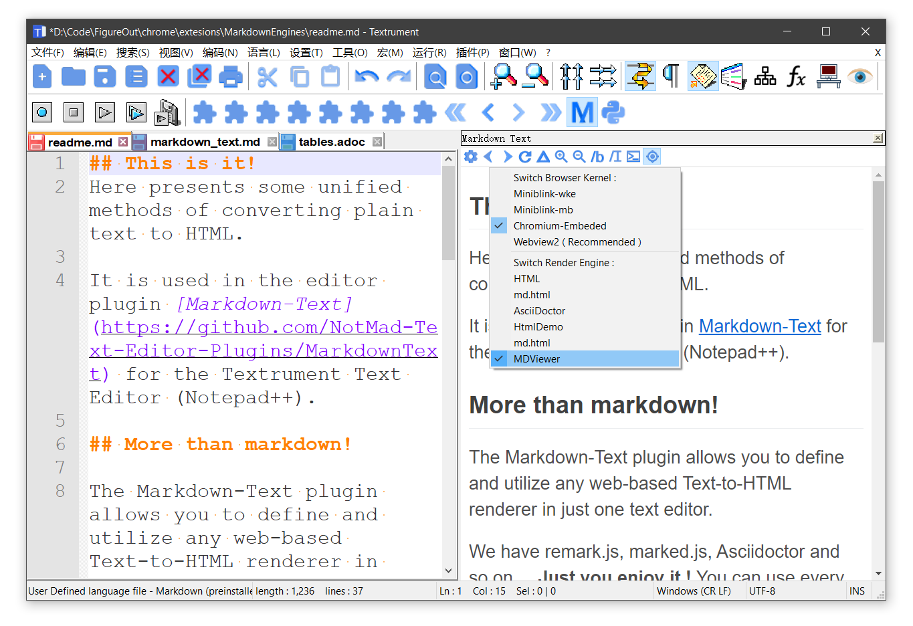

## What is it?
Here presents some unified methods of converting plain text to HTML.

It is used in the editor plugin [Markdown-Text](https://github.com/NotMad-Text-Editor-Plugins/MarkdownText) for the Textrument Text Editor (Notepad++).

## More than markdown!

The Markdown-Text plugin allows you to define and utilize any web-based Text-to-HTML renderer in just one text editor.

We have remark.js, marked.js, Asciidoctor and so on ... **Just you enjoy it !** You can use every sides of ten coins without the need of installing tons of plugins or editors. 

The plugin will dynamically switch the active renderer based on current file's extension name.

## Unified scroll-syncing methods

Synchronous scrolling ( of the editor panel and the preview panel ) is sort of an advanced feature, yet here in `ui.js` it comes with two different approachs : 

I.  **Line-To-Line Mapping.** Renderers should scatter in the output many top-level `<HL ln="0"></HL>` HTML tags, where the `ln` attribute stands for it's line number. See MDViewer for details.

II. **Percentage Mapping.** If the approach above is not available, `ui.js` will simply sync scroll-percentage between two panels.

 

[Video Demo](https://drive.google.com/file/d/1GH6_Uz3kwcxn9hfmIG8Shwezr4gM2Q4G/view?usp=sharing)

